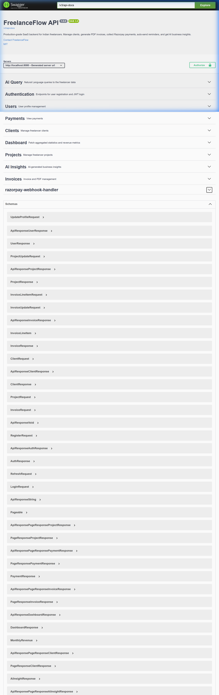
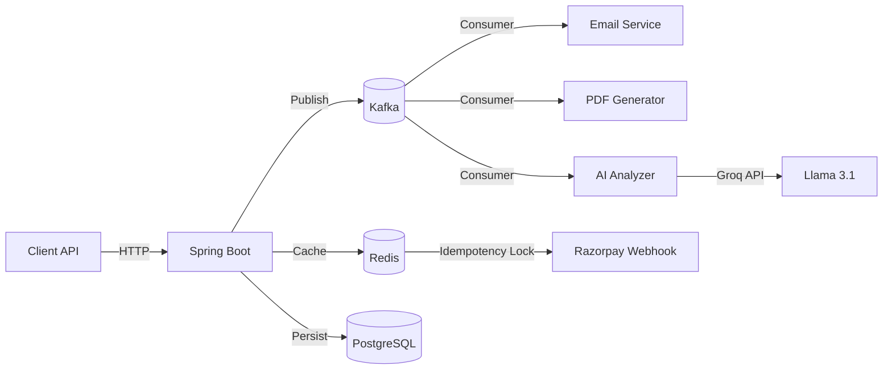

# FreelanceFlow

<p align="center">
  <b>Production-grade SaaS backend for the modern Indian freelancer.</b><br/>
  Automated invoicing · GST engine · Razorpay payments · Groq AI financial insights
</p>

<p align="center">
  
  
  
  
  
  
</p>

---

> I started this because I was tired of manually calculating GST on every invoice and chasing overdue clients. Six weeks later, this is what came out of that frustration.

## What this actually does

FreelanceFlow is a backend engine, not a CRUD tutorial. It handles the complete financial lifecycle of a freelance business:

- **Clients** walk in, **Invoices** go out (with auto-calculated 18% GST / TDS)
- **Razorpay** collects the payment via auto-generated payment links
- **Kafka** notifies your client and logs the event asynchronously — your API response never blocks
- **Groq AI** (Llama 3.1-8B) analyzes your invoice history and flags overdue risk or recommends price adjustments
- **Redis** makes sure duplicate Razorpay webhooks never double-process a payment

## API Overview (Swagger UI)



Full interactive docs available at `http://localhost:8080/swagger-ui/index.html` after running locally.

## Real API Output (verified, not mocked)

**Invoice created — ₹1,82,900 bill with auto-GST:**
```json
{
  "id": 3,
  "invoiceNumber": 3,
  "status": "DRAFT",
  "lineItems": [
    { "description": "Full-Stack System Architecture & Multi-Tenant Design", "unitPrice": 120000 },
    { "description": "DevSecOps Pipeline & Kubernetes Deployment", "unitPrice": 35000 }
  ],
  "subtotal": 155000,
  "taxPercent": 18,
  "taxAmount": 27900.00,
  "total": 182900.00,
  "dueDate": "2026-12-31"
}
```

**Groq AI financial insight (REVENUE_FORECAST):**
```json
{
  "insightType": "REVENUE_FORECAST",
  "title": "Revenue Optimization Opportunity",
  "description": "Increasing your Cloud Infrastructure unit price by 12% matches industry benchmarks for expert consultants in 2026. Estimated impact: +₹9,000 MRR.",
  "validUntil": "2026-04-24"
}
```

## Architecture

Event-driven, not monolithic. Heavy operations (PDF generation, email, AI analysis) run off the main thread via Kafka consumers.



### Tech Choices Worth Explaining

**Why Kafka for notifications?**  
Simply queueing in a thread pool would crash under load and lose events on restart. Kafka gives at-least-once delivery with consumer group offset management. The tradeoff is infra complexity — acceptable for a billing system where missed emails cost money.

**Why Redis for webhook idempotency?**  
Razorpay retries webhooks. Without a distributed lock, two pods could process the same `payment.captured` event, resulting in double-credit. `SETNX` with a 24h TTL is the simplest correct solution.

**Why JSONB for line items?**  
Invoice line items are highly variable (quantity, discount, tax overrides). A separate `invoice_line_items` table would require schema migrations every time we add a field. JSONB lets the invoice engine evolve without downtime.

## Stack

| Layer | Technology |
|---|---|
| Language | Java 17 |
| Framework | Spring Boot 3.3.4 + Spring Security |
| Database | PostgreSQL 15 + Flyway migrations |
| Messaging | Confluent Kafka |
| Cache / Lock | Redis 7 |
| AI | Groq (llama-3.1-8b-instant) |
| Payments | Razorpay |
| API Docs | Springdoc OpenAPI 3 |

## Quick Start

**Prerequisites:** Docker, Java 17, Maven

```bash
# 1. Clone and start infrastructure
git clone https://github.com/divyapratapdev/freelanceflow.git
cd freelanceflow
docker-compose up -d

# 2. Configure environment
cp .env.example .env
# Fill in your keys in .env

# 3. Run
./mvnw spring-boot:run

# Swagger UI → http://localhost:8080/swagger-ui/index.html
```

## Environment Variables

See [`.env.example`](.env.example) for all required keys. You need:
- PostgreSQL credentials
- Razorpay test keys
- Groq API key (free tier works)
- Gmail app password (for invoice email delivery)

## Running Tests

```bash
./mvnw test
```

9 unit tests across `AuthServiceTest` and `InvoiceServiceTest`. Core financial logic (tax calculation, invoice status transitions) is fully covered.

## System Design

See [`SYSTEM_DESIGN.md`](SYSTEM_DESIGN.md) for the full architecture breakdown including sequence diagrams and database schema decisions.

## Contributing

Read [`CONTRIBUTING.md`](CONTRIBUTING.md) before opening a PR. Open issues are the best way to start a conversation.

---

*Built out of frustration at 2 AM because manually calculating GST is genuinely terrible.*
