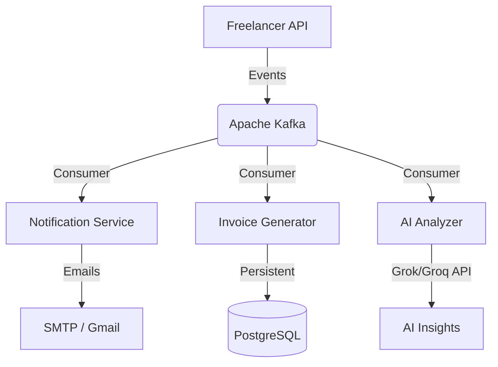
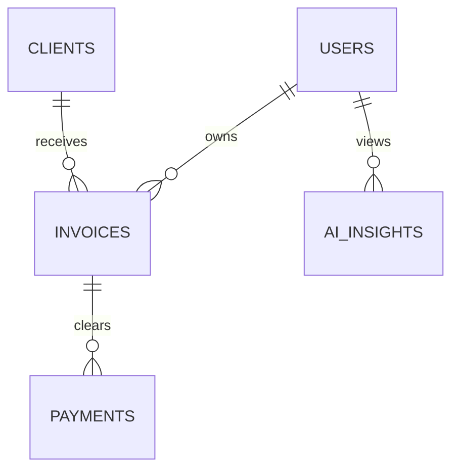

# 🏗ï¸ FreelanceFlow | System Architecture

> A high-level blueprint of the production-grade SaaS backend for Indian freelancers.

## 📡 Event-Driven Data Flow
The system is built on a decoupled, asynchronous architecture using **Apache Kafka** to ensure that heavy tasks (PDF generation, Email notifications, AI Analysis) do not block the main API threads.

## 🔒 Security & Resilience Grid

### 1. Distributed Idempotency
To prevent double-payments and race conditions during high-traffic webhooks, we utilize a **Redis-based Distributed Lock**.
*   **Provider:** Razorpay Webhooks
*   **Storage:** Redis `SETNX` with TTL (24 hours)
*   **Logic:** Every `payment_id` is locked immediately upon receipt. Duplicate events from Razorpay are gracefully ignored without taxing the database.

### 2. Stateless JWT Framework
*   **Algorithm:** HS384 / RSA-Compatible
*   **Rotation:** Automatic Refresh Token rotation to minimize hijacking surface area.
*   **Rate Limiting:** Integrated **Bucket4j** protection on Auth and Payment endpoints.

## 🗄ï¸ Data Persistence (PostgreSQL)

We leverage **JSONB** columns for high-flexibility line-item storage. This allows freelancers to add custom fields to invoices without requiring database migrations.

## 🧠 AI Financial Analytics
The system integrates with **Groq (Llama-3)** to analyze invoice trends. 
*   **Model:** `llama-3.1-8b-instant`
*   **Features:** Automated risk scoring, revenue forecasting, and profitable client identification.
